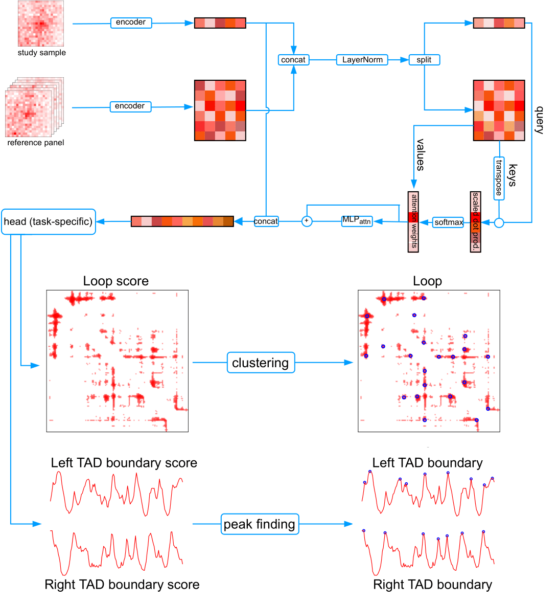

# RefHiC: Reference panel guided topological structure annotation of Hi-C data

<b>We suggest users run RefHiC on GPU. 
You can run RefHiC on CPU for TAD/loop annotations, but it is much slower than on GPU. Model training on CPU is <s>almost</s> impossible.</b>

We also provide examples with data for TAD and loop annotations under **example folder**.

You can find scripts (i.e. .R and .ipynb scripts) and data to **reproduce our analysis** in the manuscript at 
https://zenodo.org/record/7011277 .

## software dependencies
RefHiC is developed and tested on Linux machines and relies on the following packages:
<pre>appdirs==1.4.4
click==8.0.1
cooler==0.8.11
einops
h5py
importlib_resources>=5.4.0
matplotlib
numpy
pandas
requests
setuptools
tqdm</pre>
## Installation
RefHiC relies on several libraries including pytorch, scipy, etc. 
We suggest users using conda to create a virtual environment for it (It should also work without using conda, i.e. with pip). You can run the command snippets below to install RefHiC:
<pre>
git clone https://github.com/BlanchetteLab/RefHiC.git
cd RefHiC
conda create --name refhic  --file requirements.txt python=3.9
conda activate refhic
</pre>
Follow https://pytorch.org/get-started/locally/ to install pytorch. It might be the following command depending on your cuda version:
<pre>
pip install torch torchvision torchaudio --extra-index-url https://download.pytorch.org/whl/cu113
</pre>
Install additional library:
<pre>
pip install torchmetrics
pip install -U git+https://github.com/fadel/pytorch_ema
pip install tensorboard
pip install -U scikit-learn
pip install scipy==1.7.3
</pre>
Install RefHiC:
<pre>pip install --editable .</pre>
If fail, please try `python setup build` and `python setup install` first.

The installation requires network access to download libraries. Usually, the installation will finish within 5 minutes. The installation time is longer if network access is slow and/or unstable.

### Known compatibility issues
In RefHiC, we used LARS (torchlars) for contrastive pretraining. However, we find torchlars often introduces many compatibility issues. Thus, we removed LARS from RefHiC. 

If you want to use LARS for model training, please uncomment line 6 and 10 in pretrain.py and install torchlars as follows,
<pre>pip install torchlars</pre>
You can also do contrastive pretraining with Adam, but the performance may be slightly worse than with LARS. You could try to increase pre-train epochs for better accuracy.
## Initialization (configuration)
After RefHiC installation, you need to initialize RefHiC. It loads reference panel and trained models into your local space. You can run the following command:
<pre>
refhic config init</pre>
Then you will be asked to select (1) download the default reference panel or (2) load your own panel. The default one (~3GB) is for hg38 and contains 29 samples. The easiest way to run RefHiC is to load the default panel.

If you want to use the mouse reference panel (mm10), you need to dowmload it from http://repo.cs.mcgill.ca/PUB/blanchem/RefHiC/mouseRefPanel.zip and deploy it by selecting option (2) load your own panel.

<b>Our reference panel and trained models are for data at 5kb resolution only!</b>
## Select the right device in RefHiC
1. Loop and TAD prediction:

    use CPU: please set <i>--cpu True</i>
    
    use GPU: please leave <i>--cpu</i> and <i>--gpu</i> as default vaules or set <i>--gpu</i> as the index of the GPU that you want to use.
2. Training:

    use CPU: Impossible
    
    use GPU: please leave <i>--gpu</i> as default vaules or set <i>--gpu</i> as the index of the GPU that you want to use.

## Loop annotation
It involves two steps,
1. Get a list of candidate loops <pre>refhic loop pred</pre> It outputs candidate loops from both the target (i.e. input contact map) and decoy (i.e. permuted target)
    ### output format
    It contains tab separated fields as follows:
    <pre>Chr1    Start1    End1    Chr2    Start2    End2    Score    IF    P2LL    Label</pre>
    |     Field     |                                  Detail                                 |
    |:-------------:|:-----------------------------------------------------------------------:|
    |   Chr1/Chr2   | chromosome names                                                        |
    | Start1/Start2 | start genomic coordinates                                               |
    |   End1/End2   | end genomic coordinates (i.e. End1=Start1+resol)                        |
    |     Score     | RefHiC's loop score [0~1]                                               |
    |       IF      | Interaction frequency                                                   |
    |      P2LL     | Peak to lower left ratio [for information only, RefHiC does not use it] |
    |     Label     | loop candidate is from target/decoy set [will be used in pool]          |
2. slect loops from loop candidates<pre>refhic loop pool</pre> It outputs loops detected from the target data by FDR control. You may need to increase <i>alpha</i> to 0.1 or higher for very low coverage or low quality Hi-C data to select more loops. Sadlly, it will also produce more false positive annotations.  
    ### output format
    Same as above but without the Label field (all loops are from the target).
## TAD annotation
TAD annotation is simply, you can run <pre>refhic tad pred</pre>
For FDR control, you can to increase <i>alpha</i> to 0.1 or higher for very low coverage or low quality Hi-C data to select more TAD boundaries. Sadlly, you will see more false positive annotations.
### output format 
<b>output file 1. Boundary scores:</b>

RefHiC outputs 7 columns tab separated fields (without header) to a file (named user_specific_prefix.bed) for TAD annotation. Each row contains genomic coordinate, boundary scores and 0/1 fields to indicate boundary annotation:

<pre>
Chr    Start    End    LeftScore    LeftBoundary    RightScore    RigihtBoundary
</pre>
|            Field            |                        Detail                       |
|:---------------------------:|:---------------------------------------------------:|
|             Chr             | chromosome name                                     |
|            Start            | start genomic coordinate                            |
|             End             | end genomic coordinate (i.e. End=Start+resol)       |
|     LeftScore/RightScore    | boundary scores [-1~1]                              |
| LeftBoundary/RigihtBoundary | boundary annotations [1: boundary, 0: non-boundary] |

<b>output file 2. TAD: </b>

a bed file contains TADs (1 TAD per line) 
## Sanity check
It is hard to evaluate TAD or loop annotations in the real experiments as we don't have ground truth. You can use the pileup option for a quick check
<pre>refhic util pileup</pre> 
It will produce a pileup image for given foci (i.e. predicted loops or TAD boundaries). You can turn on <i>p2ll</i> option to compute P2LL for the averaged contact pairs. It is helpful for loop analysis.
## Advanced usage
### 1. How to create my own reference panel?
Let's assume you already have a group of Hi-C contact maps in .mcool format. If your data is in other format, you can use try cooler (https://cooler.readthedocs.io/) to convert data into .mcool. Alternatively, you can use 4dn pipeline (https://github.com/4dn-dcic/docker-4dn-hic) to process your fastq data.
To create your own reference panel, you need to:
1. Convert all .mcool files to .bcool files (band matrix based cooler format). .bcool is our own format. We discard useless interactions (i.e. contact distance >3MB) to save space:<pre>refhic util cool2bcool [OPTIONS] COOL BCOOL</pre>
2. create a <b>meta.csv</b> file for your reference panel [header name: sample, file]: <pre>sample,file
prostate,HIC00001.hg38.mapq_10.1000.bcool
Human embryonic kidney,HIC00002.hg38.mapq_10.1000.bcool
... </pre>
3. compress all .bcool files and meta.csv into a zip file.
4. Load reference panel by run, <pre>refhic config init</pre>
select (2) load your own panel.

NB: We believe you can still use our trained models with your own reference panel as we used several approaches to train RefHiC to be robust to referenced samples. But, the performance might be worse than with the default panel. You may need to retrain a model with your own reference panel.

### 2. How to train my own model?
The core steps are get labelled data and study Hi-C contact maps.
1. <b> Labelled data:</b> Similar to our manuscript, you have at least two options. (1) Whenever orthogonal data existed (i.e. ChIA-PET, HiCHIP, etc.), use them to get positive cases. For negative cases please refer to our paper. (2) If you don't have high quality orthogonal data, you may get labels by applying conventional tools on the most high quality contact map that you have to get labels. 
2. <b> contact maps: </b> One significant contribution of RefHiC is the introducing of data augmentation by downsampling technique. So you need to downsample your original contact map into a series of downsamplings. You can do it by applying <i>FANC</i> on .mcool or use <i>shuf</i> to shuffle contact pair list and run 4DN pipeline to create .mcool for downsamplings.  
3. run the following command to create training dataset, you will be asked to provide labels (i.e. foci) and comma separated downsampled .mcool files: <pre>refhic util traindata</pre>  You wiil be aksed to select window size. We found win=21 (i.e. w=10) for loop and win=41 (i.e. w=20) for TAD work well for 5kb data.
4. train loop model: <pre>refhic loop train</pre> train TAD model <pre>refhic tad train</pre> labelled data (foci) format:<pre>
      chr1 bin1_start bin1_end chr2 bin2_start bin2_end class_1 <class_2 ...></pre> You could have more than one label for each training case (i.e. TAD has two labels (left,right), loop has one label)
      
### 3. How to edit config file?
User We don't ask to edit config file manually, but you can still do it if you want: <pre>refhic config edit</pre>

### 4. How to use local reference panel, or models?
RefHiC will load reference panel and models from the configuration file by default. But you can still use your own models or reference panel without write them into the configuration file.
There are two parameters: (1) --reference for reference panel; (2) --modelState for model. You can specific them when you run <i>pred</i> for loop or TAD annotation. The <i>reference</i> parameter takes a meta.csv as input. (NB: <i>file</i> field should contain absolute path to data)

## Citation
If you use RefHiC in your work, please cite our paper:

Zhang, Y., Blanchette, M. Reference panel guided topological structure annotation of Hi-C data. Nat Commun 13, 7426 (2022). https://doi.org/10.1038/s41467-022-35231-3

## Contact
A GitHub issue is preferable for all problems related to using RefHiC. 

For other concerns, please email Yanlin Zhang or Mathieu Blanchette (yanlin.zhang2@mail.mcgill.ca, blanchem@cs.mcgill.ca).