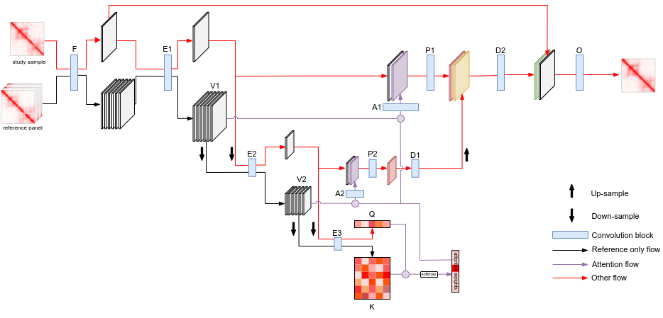

# RefHiC-SR: Reference panel guided super-resolution inference of Hi-C data

<b>Please follow [this](../README.md) to install and configure RefHiC.</b>

<b>We suggest users run RefHiC-SR on GPU. 
You can run RefHiC-SR on CPU, but it is much slower than on GPU. Model training on CPU is <s>almost</s> impossible.</b>

## Contact enhancement
NB: Our reference panel is for <b>hg38</b> at <b>5kb</b>. You can follow the [instruction](../README.md) to create your own reference panel.  

Enhancing chr1 in test.mcool: 
<pre>refhic sr pred test.mcool output.bedpe --chrom chr1</pre> 
It outputs enhanced contact maps in a bedpe file. 
    ### output format
    It contains tab separated fields as follows:
    <pre>Chr1    Start1    End1    Chr2    Start2    End2    enhancedIF    IF</pre>

|     Field     |                      Detail                      |
|:-------------:|:------------------------------------------------:|
|   Chr1/Chr2   |                 chromosome names                 |
| Start1/Start2 |             start genomic coordinates            |
|   End1/End2   | end genomic coordinates (i.e. End1=Start1+resol) |
|   enhancedIF  |     RefHiC-SR enhanced Interaction frequency     |
|       IF      |               Interaction frequency              |

## Model training
NB: RefHiC-SR comes with a pretrained model. You don't need to train your own model in most case.
1. Preprocessing:
<pre>refhic util ceptraindata comma_separated_list_of_downsampled_mcool_files full_coverage.mcool val/hicMatrix --chrom validation_chrs</pre>
<pre>refhic util ceptraindata comma_separated_list_of_downsampled_mcool_files full_coverage.mcool train/hicMatrix --chrom training_chrs</pre>
<pre>refhic util ceptraindata comma_separated_list_of_downsampled_mcool_files full_coverage.mcool test/hicMatrix --chrom test_chrs</pre>
2. Training:
<pre>refhic sr train TRAINDATA VALDATA PREFIX</pre>

You can use scripts in https://doi.org/10.5281/zenodo.7761968
 to reproduce our experiments.
## Citation
If you use RefHiC in your work, please cite our paper:

Zhang, Y., Blanchette, M. Reference panel guided super-resolution inference of
Hi-C data

## Contact
A GitHub issue is preferable for all problems related to using RefHiC-SR. 

For other concerns, please email Yanlin Zhang or Mathieu Blanchette (yanlin.zhang2@mail.mcgill.ca, blanchem@cs.mcgill.ca).
